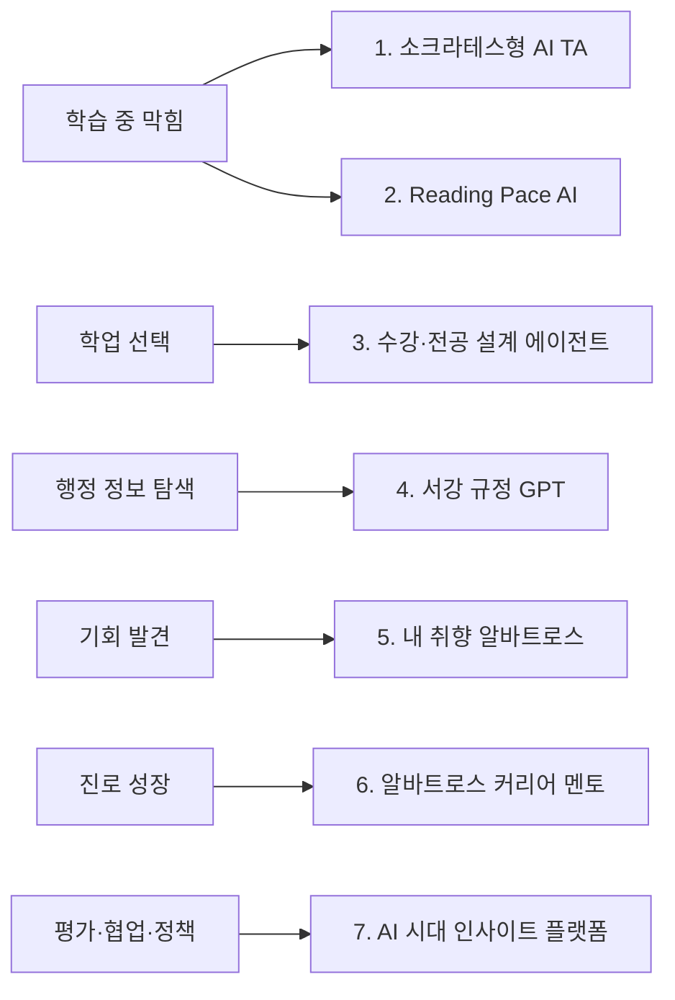
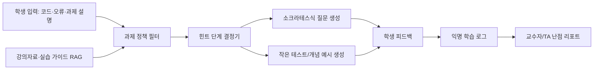
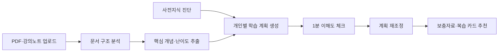
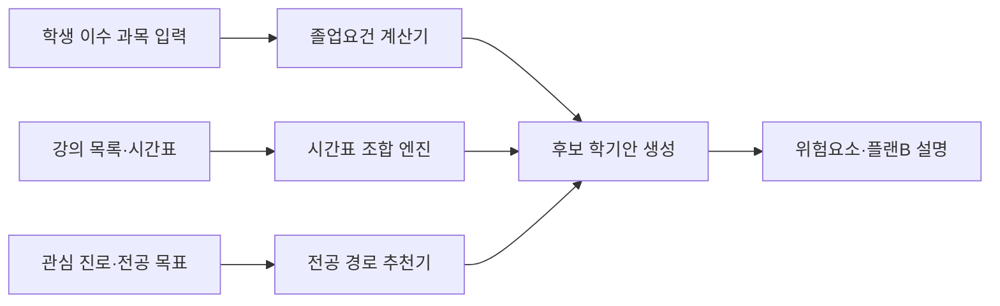
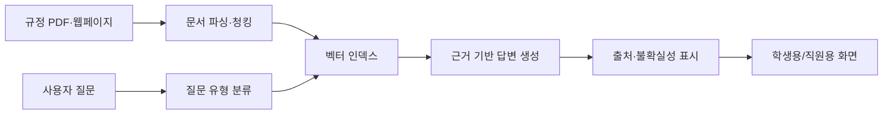
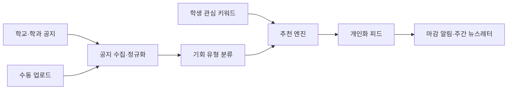
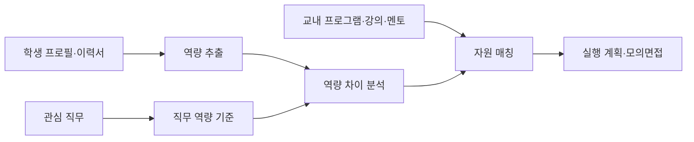
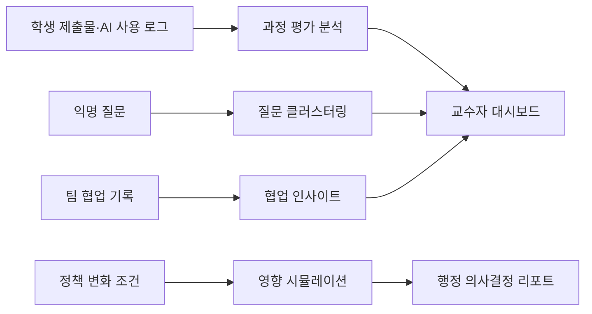
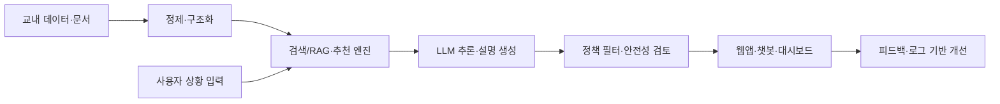

# 서강대학교 생성형 AI 기반 아이디어 공모전 제안 포트폴리오

작성일: 2026-05-21  
목적: 여러 개의 공모전 아이디어를 각각 독립 제안서로 제출할 수 있도록, 구현제안서 양식의 필수 항목에 맞춰 구체화한다.

---

## 0. 공모전 이해와 작성 프레임

### 대회 목적

이번 공모전은 단순히 "재미있는 AI 아이디어"를 뽑는 행사가 아니라, 다음 세 가지를 동시에 본다.

1. 전 구성원이 대학 현장의 문제의식을 발굴했는가
2. 생성형 AI로 실행 가능성이 검증된 혁신적 해결책을 제안했는가
3. 향후 사업화, 제도화, 서비스 운영으로 이어질 수 있는가

따라서 제안서는 기술 설명만으로 끝나면 약하다. 반드시 "누가 어떤 불편을 실제로 겪는가", "왜 생성형 AI가 필요한가", "MVP를 어느 범위까지 만들 수 있는가", "서강대학교 안에서 어떤 데이터와 제도에 연결되는가"를 함께 보여줘야 한다.

### 공모 분야 매핑

| 분야 | 관련 아이디어 | 제출 전략 |
|---|---|---|
| ① 교육 혁신 | 실시간 수강·전공 설계 에이전트, Reading Pace AI | 맞춤형 교육과 학사 지원을 강조 |
| ② 연구 지원 | 학술 글쓰기 claim 검증, IRB·규정 확장형 서강 규정 GPT | 연구 프로세스 자동화와 규정 검토 지원으로 확장 가능 |
| ③ 행정·운영 혁신 | 서강 규정 GPT, 정책 시뮬레이터 | 반복 문의 감소와 의사결정 지원 강조 |
| ④ 학생생활·캠퍼스서비스 | 내 취향 알바트로스, 알바트로스 커리어 멘토 | 학생 친화 분야로 경험 기반 문제 정의 강조 |
| ⑤ 학습 지원·AI 활용 교육 | 소크라테스형 AI TA, Reading Pace AI, 팀플 코파일럿 | AI 리터러시, 학습 효율화, 팀 프로젝트 지원 강조 |
| ⑥ 캠퍼스·사회 혁신 | 평가·협업·정책 인사이트, 외국인/장애학생 지원 확장 | 복지, 다양성, 공정성, 사회공헌 가치 강조 |

### 구현제안서 양식 기준

양식은 표지 제외 5장 이내이므로, 각 아이디어별 제안서는 다음 순서로 압축하는 것이 좋다.

| 양식 항목 | 반드시 들어갈 내용 |
|---|---|
| 1.1 기술명 | 심사자가 바로 이해할 수 있는 서비스명과 한 줄 설명 |
| 1.2 분야 | 공모 분야 ①~⑥ 중 핵심 분야 1개, 보조 분야 1개 |
| 1.4 제안배경 | 학생·교원·직원이 실제로 겪는 문제, 기존 방식의 한계 |
| 1.5 소요기간 | MVP 기준 3~8주, 실증 확장 기준 3개월 |
| 1.6 유사기술 | ChatGPT, 학사 챗봇, LMS, 시간표 앱, 커리어 플랫폼 등 |
| 1.7 차별점 | 서강 데이터, 과목 정책, 근거 인용, 윤리 설계, 학생 경험 기반 |
| 2.1 기술목적 | 해결하려는 핵심 문제와 생성형 AI 필요성 |
| 2.2 기술구조 | 입력, 검색/RAG, 추론, 정책 필터, 출력, 로그/대시보드 |
| 2.3 주요기능 | MVP에서 보여줄 3개 이상의 기능 |
| 2.4 결과물 형상 | 웹앱, 챗봇, API, 대시보드, 리포트, 알림 서비스 |
| 2.5 배포방식 | 웹 애플리케이션, Splus/LMS 연동, API, 관리자 콘솔 |
| 2.6 혁신적 요소 | 기존 기술 대비 새로운 판단·추천·평가 방식 |
| 2.7 도전적 요소 | 데이터 품질, 개인정보, 환각 방지, 평가 공정성 등 |
| 3.1 구현범위 | 최소 3개 세부 업무 |
| 3.2 구현계획 | 기획, 데이터 구축, 프로토타입, 검증, 고도화 일정 |
| 3.3 기술스택 | LLM, RAG, 벡터DB, 웹 프레임워크, 인증, 배포 환경 |

---

## 1. 전체 포트폴리오 전략

여러 개를 출품한다면, 아이디어들이 서로 경쟁하는 모양보다 "서강 캠퍼스 AI 생태계"의 서로 다른 진입점처럼 보이게 만드는 것이 좋다.

### 제출 우선순위와 성격

| 순위 | 아이디어 | 추천 분야 | 강점 | 주의점 |
|---|---|---|---|---|
| 1 | 소크라테스형 AI TA | ⑤ 학습 지원·AI 활용 교육 | 공모 취지, 교육 가치, AI 윤리 메시지가 강함 | 정답 제공 방지 정책을 구체화해야 함 |
| 2 | 실시간 수강·전공 설계 에이전트 | ① 교육 혁신 | 학생 체감도와 서강 특화성이 높음 | 실제 학사 데이터 접근 없이도 가능한 MVP 설계 필요 |
| 3 | 서강 규정 GPT | ③ 행정·운영 혁신 | 구현 가능성과 행정 효율 효과가 명확함 | 일반 RAG 챗봇처럼 보이지 않게 근거·모드·책임 경계를 강조 |
| 4 | 내 취향 알바트로스 | ④ 학생생활·캠퍼스서비스 | 학생 친화 분야와 잘 맞고 데모가 쉬움 | 추천 품질과 공지 수집 범위를 명확히 제한 |
| 5 | Reading Pace AI | ⑤ 학습 지원·AI 활용 교육 | 비전공자와 인문사회계 학생에게도 설득력 있음 | PDF 분석과 퀴즈 생성의 품질 검증 필요 |
| 6 | 알바트로스 커리어 멘토 | ④ 학생생활·캠퍼스서비스 | 진로·경력 문제를 교내 자원과 연결 | 민감한 이력 데이터 보호 필요 |
| 7 | AI 시대 평가·협업·정책 인사이트 | ③/⑤/⑥ 복합 | 시대성과 확장성이 가장 큼 | 범위가 크므로 MVP를 하나로 좁혀야 함 |

---

# 1. Sogang Socratic AI TA

## 제안서 요약

| 항목 | 내용 |
|---|---|
| 기술명 | Sogang Socratic AI TA: 정답이 아니라 질문을 주는 AI 조교 |
| 추천 분야 | ⑤ 학습 지원·AI 활용 교육, ① 교육 혁신 |
| 한 줄 요약 | 강의자료와 과제 가이드라인을 기반으로 학생에게 정답 대신 단계별 힌트와 유도 질문을 제공하는 학습 지원 에이전트 |
| MVP 소요기간 | 4~6주 |
| 핵심 사용자 | 프로그래밍·수식·실습 과제에서 막힌 학생, 반복 질문을 받는 TA, AI 활용 기준을 세우려는 교수자 |

## 1. 일반 사항

### 1.1 기술명

Sogang Socratic AI TA: 정답이 아니라 질문을 주는 AI 조교

### 1.2 분야

⑤ 학습 지원·AI 활용 교육. 보조 분야는 ① 교육 혁신.

### 1.4 제안배경

학생들은 과제 마감 직전 코드 오류, 수식 전개, 실습 환경 문제에 자주 막힌다. 교수자와 TA에게 즉시 질문하기 어렵고, 일반 ChatGPT에 질문하면 전체 정답 코드나 풀이를 얻어 학습 과정이 생략될 수 있다. 대학 입장에서는 AI 사용을 무조건 금지하기보다, 학생이 AI를 윤리적이고 학습 중심적으로 활용하도록 안내하는 체계가 필요하다.

### 1.5 소요기간

MVP 4~6주. 과목 1개 실증과 교수자 대시보드까지 포함하면 3개월.

### 1.6 유사기술

ChatGPT, GitHub Copilot, Khanmigo, 코드 튜터 챗봇, LMS Q&A 게시판.

### 1.7 차별점

일반 AI 코딩 도구는 정답 생성 능력이 강하지만, 이 서비스는 과목별 허용 범위와 교수자 정책을 반영해 답변 수준을 조절한다. "정답 제공"이 아니라 "오류 원인을 찾는 질문", "작은 테스트 케이스", "개념 확인"을 우선 제공한다. 교수자에게는 개인별 정답이 아니라 익명화된 공통 난점 리포트를 제공해 수업 개선에 활용할 수 있다.

## 2. 기술 명세

### 2.1 기술목적

학생이 AI를 과제 대리 수행 도구로 쓰는 것을 줄이고, 막힌 지점을 스스로 진단하도록 돕는다. 동시에 TA의 반복 응답 부담을 낮추고, 교수자가 과제별 AI 사용 기준을 운영할 수 있게 한다.

### 2.2 기술구조

### 2.3 주요기능

1. 과제별 답변 정책 설정: 전체 풀이 금지, 부분 힌트 허용, 테스트 케이스 허용 등.
2. 단계형 힌트: 오류 메시지 해석, 관련 개념 확인, 의심 위치 안내, 최소 수정 방향 제시.
3. 정답 직접 제공 방지: 전체 코드 생성 요청을 감지하고 질문형 피드백으로 전환.
4. 학습 로그 리포트: 많이 발생한 오류 유형, 개념별 난점, 질문 빈도 시각화.
5. AI 리터러시 피드백: 학생이 어떤 프롬프트를 썼고 어떻게 검증했는지 되돌아보게 함.

### 2.4 결과물 형상

웹 기반 챗봇과 교수자 대시보드. MVP는 단일 과목용 웹앱으로 제공하고, 확장 시 LMS 과제 페이지 안에 임베드한다.

### 2.5 배포방식

웹 애플리케이션, LMS/Splus 연동 API, 과목별 관리자 콘솔. 초기에는 Vercel 또는 교내 서버에 배포 가능.

### 2.6 혁신적 요소

AI 활용을 금지·탐지의 문제로 보지 않고, "어떤 도움까지 허용할 것인가"를 과제별 정책으로 제어한다. 생성형 AI를 학습 윤리와 자기주도 학습 훈련 도구로 전환한다.

### 2.7 도전적 요소

정답과 힌트의 경계를 안정적으로 판단해야 한다. 과목별 자료 품질, LLM 환각, 학생의 우회 질문, 학습 로그 익명화가 핵심 난점이다.

## 3. 구현 방법 및 계획

### 3.1 구현범위

| 세부업무 | 내용 |
|---|---|
| 세부업무 1 | Python 기초 과제 1개를 대상으로 과제 설명, 허용 라이브러리, 평가 기준을 구조화 |
| 세부업무 2 | 코드·오류 메시지 입력 UI와 단계형 힌트 생성 파이프라인 구현 |
| 세부업무 3 | 정답 제공 방지 정책 필터와 실패 횟수 기반 힌트 구체화 로직 구현 |
| 세부업무 4 | 익명화된 오류 유형 Top 5 대시보드 구현 |

### 3.2 구현계획

| 기간 | 계획 |
|---|---|
| 1주차 | 과목·과제 선정, 답변 정책 정의, 테스트 오류 사례 수집 |
| 2~3주차 | RAG 인덱스, 챗 UI, 힌트 생성 프롬프트 구현 |
| 4주차 | 정답 방지 필터, 로그 구조, 교수자 리포트 구현 |
| 5~6주차 | 학생 5~10명 사용성 테스트, 힌트 품질 개선 |

### 3.3 기술스택

Next.js 또는 React, FastAPI, OpenAI/Claude 계열 LLM, LangChain 또는 LlamaIndex, PostgreSQL, pgvector 또는 Chroma, Vercel 또는 Docker 기반 배포.

### 데모 시나리오

학생이 Python 리스트 과제에서 `IndexError`가 발생한 코드와 오류 메시지를 입력한다. AI TA는 정답 코드를 주지 않고 "반복문이 리스트 길이를 넘어가는 순간이 있는지 확인해보자"는 질문, 작은 테스트 입력, 관련 개념 설명을 단계적으로 제공한다. 마지막에는 학생이 수정한 코드를 다시 넣고 해결 여부와 배운 개념을 요약한다.

### 리스크와 대응

| 리스크 | 대응 |
|---|---|
| 학생이 정답을 우회 요청 | 과제 정책 필터와 답변 수준 제한 |
| 힌트가 너무 추상적 | 실패 횟수와 학생 응답에 따라 점진적으로 구체화 |
| 교수자 업무 증가 | 강의자료 업로드와 정책 템플릿만으로 초기 세팅 |
| 개인정보 문제 | 코드와 로그를 과제 단위 익명 통계로 집계 |

---

# 2. Reading Pace AI

## 제안서 요약

| 항목 | 내용 |
|---|---|
| 기술명 | Reading Pace AI: 이해 속도 기반 학습 매니저 |
| 추천 분야 | ⑤ 학습 지원·AI 활용 교육, ① 교육 혁신 |
| 한 줄 요약 | 페이지 수가 아니라 학생의 사전지식과 이해도를 기준으로 학습 순서와 속도를 조정하는 AI 학습 매니저 |
| MVP 소요기간 | 4~6주 |
| 핵심 사용자 | 전공 교재, 논문, 긴 강의노트를 읽어야 하는 학생 |

## 1. 일반 사항

### 1.1 기술명

Reading Pace AI: 이해 속도 기반 학습 매니저

### 1.2 분야

⑤ 학습 지원·AI 활용 교육. 보조 분야는 ① 교육 혁신.

### 1.4 제안배경

학생들은 "몇 페이지까지 읽어야 하는지"는 알아도 "무엇을 이해하고 넘어가야 하는지"를 놓치기 쉽다. 같은 10쪽이라도 배경지식에 따라 난이도와 소요 시간이 크게 다르다. 기존 플래너는 일정 관리에 강하지만, 이해도 기반 조정과 개념 보충에는 약하다.

### 1.5 소요기간

MVP 4~6주. 과목별 자료 추천과 학습 이력 기반 고도화는 3개월.

### 1.6 유사기술

Notion AI, ChatPDF, Quizlet, Khan Academy, 일반 학습 플래너 앱.

### 1.7 차별점

문서를 요약하는 데서 끝나지 않고, 학생의 이해도 퀴즈 결과에 따라 다음 학습 순서와 분량을 재조정한다. 수식, 그래프, 개념 연결 질문을 별도 처리해 전공·교양 자료에 모두 적용할 수 있다.

## 2. 기술 명세

### 2.1 기술목적

학생이 긴 자료를 기계적으로 읽는 대신, 핵심 개념을 이해했는지 확인하며 학습 속도를 조절하도록 돕는다.

### 2.2 기술구조

### 2.3 주요기능

1. PDF/강의노트 구조 분석과 챕터별 핵심 개념 추출.
2. 사전지식 진단 퀴즈와 자기평가.
3. 3일, 7일, 14일 학습 계획 자동 생성.
4. 이해도 체크 기반 페이스 재조정.
5. 회피 행동 코칭과 짧은 복습 카드 생성.

### 2.4 결과물 형상

웹 기반 학습 플래너, 개인별 학습 캘린더, 퀴즈 카드, 복습 리포트.

### 2.5 배포방식

웹앱과 모바일 반응형 페이지. 향후 LMS 강의자료 업로드와 연동.

### 2.6 혁신적 요소

"분량 중심 플래너"를 "이해 상태 중심 플래너"로 전환한다. 생성형 AI가 학습 자료를 읽고, 학생의 반응을 기반으로 계획을 계속 수정한다.

### 2.7 도전적 요소

문서 난이도 추정, 수식·표·그래프 해석, 퀴즈 품질, 학생 자기보고의 신뢰성 관리가 어렵다.

## 3. 구현 방법 및 계획

### 3.1 구현범위

| 세부업무 | 내용 |
|---|---|
| 세부업무 1 | PDF 업로드, 텍스트 추출, 챕터/소제목 구조화 |
| 세부업무 2 | 핵심 개념 추출, 난이도 태깅, 사전지식 진단 퀴즈 생성 |
| 세부업무 3 | 개인별 학습 계획과 이해도 기반 재조정 로직 구현 |
| 세부업무 4 | 복습 카드, 보충 설명, 학습 리포트 UI 구현 |

### 3.2 구현계획

| 기간 | 계획 |
|---|---|
| 1주차 | 샘플 강의노트 선정, 문서 추출 품질 점검 |
| 2~3주차 | 개념 추출·퀴즈 생성·계획 생성 파이프라인 구현 |
| 4주차 | 학습 진행 UI와 페이스 재조정 로직 구현 |
| 5~6주차 | 학생 테스트 후 퀴즈 난이도와 계획 추천 개선 |

### 3.3 기술스택

React, FastAPI, PDF 파서, LLM API, RAG, PostgreSQL, 캘린더 UI 라이브러리.

### 데모 시나리오

학생이 경제학 강의노트 PDF를 올리고 시험까지 7일 남았다고 입력한다. 시스템은 챕터별 핵심 개념과 난이도를 추출하고, 첫날에는 사전지식이 부족한 개념을 먼저 읽도록 계획한다. 중간 퀴즈 오답이 많으면 다음 날 계획을 줄이고 보충 설명을 추가한다.

### 리스크와 대응

| 리스크 | 대응 |
|---|---|
| PDF 추출 오류 | 텍스트 기반 자료 우선 지원, 수동 보정 기능 제공 |
| 퀴즈 품질 불안정 | 근거 문장 연결과 난이도 태그 검수 |
| 과도한 학습 감시 느낌 | 개인용 리포트 중심, 교수자 공유는 선택형 |

---

# 3. 실시간 수강·전공 설계 에이전트

## 제안서 요약

| 항목 | 내용 |
|---|---|
| 기술명 | Sogang Course Architect: 수강·전공 설계 AI 에이전트 |
| 추천 분야 | ① 교육 혁신, ④ 학생생활·캠퍼스서비스 |
| 한 줄 요약 | 졸업요건, 시간표, 선수과목, 자기설계전공, 진로 목표를 함께 고려해 학기 수강 전략을 추천 |
| MVP 소요기간 | 5~8주 |
| 핵심 사용자 | 수강신청과 졸업요건 점검에 어려움을 겪는 학생 |

## 1. 일반 사항

### 1.1 기술명

Sogang Course Architect: 수강·전공 설계 AI 에이전트

### 1.2 분야

① 교육 혁신. 보조 분야는 ④ 학생생활·캠퍼스서비스.

### 1.4 제안배경

수강신청은 시간표를 예쁘게 짜는 문제가 아니라, 졸업요건, 전공 필수, 복수전공, 자기설계전공, 선수과목, 정원, 이동 시간, 진로 목표를 동시에 고려해야 하는 복잡한 의사결정이다. 학생들은 PDF 요건표, 학과 홈페이지, 선배 조언, 강의계획서를 따로 확인한다.

### 1.5 소요기간

MVP 5~8주. 실제 학사 시스템 연동과 다전공 확장은 3~6개월.

### 1.6 유사기술

에브리타임 시간표, 학사포털 졸업요건 조회, 일반 시간표 생성기, 대학별 수강신청 도우미.

### 1.7 차별점

단순 시간표 생성이 아니라 학업 경로 설계에 초점을 둔다. 특히 서강의 자기설계전공, 복수전공, 융합 교육 특성과 연결해 "이번 학기 선택이 졸업과 진로에 어떤 영향을 주는지" 설명한다.

## 2. 기술 명세

### 2.1 기술목적

학생이 흩어진 학사 정보를 직접 조합하지 않아도, 자신의 이수 현황과 목표에 맞는 수강 전략을 이해 가능한 근거와 함께 얻도록 한다.

### 2.2 기술구조

### 2.3 주요기능

1. 이수 과목 기반 졸업요건 자동 점검.
2. 희망 강의, 공강 선호, 이동 시간, 난이도 분산을 고려한 시간표 후보 생성.
3. 자기설계전공·복수전공 경로 제안.
4. 수강신청 우선순위와 실패 시 플랜 B 제공.
5. 필터버블을 깨는 "수강신청 타로" 탐색 추천.

### 2.4 결과물 형상

웹 기반 수강 설계 도구, 졸업요건 리포트, 후보 시간표 카드, 수강신청 전략표.

### 2.5 배포방식

초기에는 공개 강의 정보와 수동 입력 기반 웹앱. 이후 학사 시스템 또는 Splus 인증 연동.

### 2.6 혁신적 요소

요건 충족 여부만 말하지 않고, 학생의 관심 진로와 자기설계전공 가능성까지 함께 설계한다. 추천 이유와 위험요소를 자연어로 설명해 상담 경험에 가깝게 만든다.

### 2.7 도전적 요소

학사 데이터 정확성, 요건 변경 반영, 개인정보 보호, 추천 결과의 책임 범위가 중요하다.

## 3. 구현 방법 및 계획

### 3.1 구현범위

| 세부업무 | 내용 |
|---|---|
| 세부업무 1 | 특정 전공 1~2개 졸업요건과 공개 강의 정보를 구조화 |
| 세부업무 2 | 학생 이수 과목 수동 입력과 요건 충족 계산기 구현 |
| 세부업무 3 | 후보 시간표 생성과 충돌·선수과목·난이도 경고 구현 |
| 세부업무 4 | 진로 목표 기반 과목 추천과 플랜 B 설명 생성 |

### 3.2 구현계획

| 기간 | 계획 |
|---|---|
| 1~2주차 | 전공 범위 선정, 요건표와 강의정보 데이터화 |
| 3~4주차 | 요건 계산기와 시간표 조합 엔진 구현 |
| 5~6주차 | 자연어 설명, 플랜 B, UI 구현 |
| 7~8주차 | 실제 학생 사례 테스트와 예외 규칙 보완 |

### 3.3 기술스택

React, TypeScript, FastAPI, PostgreSQL, OR-Tools 또는 자체 조합 알고리즘, LLM 설명 생성, Vercel/Docker.

### 데모 시나리오

학생이 이수 과목과 관심 진로를 입력한다. 시스템은 남은 전공 필수 2개, 교양 요건 1개를 표시하고, 이번 학기에 가능한 후보 시간표 3개를 제안한다. 각 후보에는 졸업요건 충족도, 난이도, 플랜 B, 자기설계전공 연결 가능성이 표시된다.

### 리스크와 대응

| 리스크 | 대응 |
|---|---|
| 학사 정보 오류 | 데이터 출처와 업데이트 날짜 표시, 최종 확인 안내 |
| 범위 과대 | 특정 전공 1~2개 MVP로 제한 |
| 추천 책임 문제 | 상담 보조 도구임을 명시하고 근거 규칙 표시 |

---

# 4. 서강 규정 GPT

## 제안서 요약

| 항목 | 내용 |
|---|---|
| 기술명 | Sogang Policy GPT: 근거를 보여주는 학사·행정 규정 AI |
| 추천 분야 | ③ 행정·운영 혁신, ② 연구 지원 |
| 한 줄 요약 | 학칙, 내규, 장학, 등록금 환불, 휴복학 규정을 통합 검색하고 조항·페이지 근거와 함께 답변 |
| MVP 소요기간 | 3~5주 |
| 핵심 사용자 | 규정을 찾는 학생, 반복 문의를 처리하는 행정 직원 |

## 1. 일반 사항

### 1.1 기술명

Sogang Policy GPT: 근거를 보여주는 학사·행정 규정 AI

### 1.2 분야

③ 행정·운영 혁신. 보조 분야는 ② 연구 지원.

### 1.4 제안배경

학사 규정, 장학, 등록금 환불, 휴복학, 연구·IRB 관련 안내는 여러 PDF와 웹페이지에 흩어져 있다. 학생은 어느 문서를 봐야 할지 모르고, 직원은 케이스별 근거 조항을 찾는 데 시간이 걸린다. 구두 안내가 불명확하면 재문의와 민원으로 이어질 수 있다.

### 1.5 소요기간

MVP 3~5주. 부서별 운영과 문서 업데이트 체계까지 포함하면 3개월.

### 1.6 유사기술

일반 RAG 챗봇, 대학 FAQ 챗봇, 사내 규정 검색 봇, ChatPDF.

### 1.7 차별점

학생용 쉬운 설명과 직원용 조항 중심 설명을 분리한다. 모든 답변에 문서명, 조항, 페이지, 링크, 최신 확인 필요 여부를 표시한다. 답변 불가·부서 확인 필요를 명확히 말하는 것이 핵심이다.

## 2. 기술 명세

### 2.1 기술목적

규정 탐색 시간을 줄이고, 학생과 직원이 같은 근거를 보며 의사소통하도록 한다. 생성형 AI의 환각 위험을 근거 인용과 불확실성 표시로 줄인다.

### 2.2 기술구조

### 2.3 주요기능

1. 학칙·학사·장학·환불·휴복학 규정 통합 검색.
2. 조항, 페이지, 문서 링크 기반 답변.
3. 학생용 쉬운 설명과 직원용 처리 근거 모드.
4. 최신 공지 확인 필요, 담당 부서 확인 필요 플래그.
5. 반복 질문 통계와 문서 공백 리포트.

### 2.4 결과물 형상

웹 챗봇, 관리자 문서 업로드 콘솔, 답변 근거 뷰어, 반복 문의 대시보드.

### 2.5 배포방식

교내 포털 링크 또는 Splus FAQ 페이지 임베드. 부서별 문서 업로드 API 제공 가능.

### 2.6 혁신적 요소

답을 자연어로만 제공하지 않고, 근거 문서와 책임 경계를 함께 제공한다. 행정 직원의 케이스 처리 보조 도구로도 사용할 수 있다.

### 2.7 도전적 요소

최신 규정 유지, 문서 충돌, 환각 방지, 민감한 개인 상황에 대한 책임 경계 설정이 어렵다.

## 3. 구현 방법 및 계획

### 3.1 구현범위

| 세부업무 | 내용 |
|---|---|
| 세부업무 1 | 휴학·복학·장학·등록금 환불 문서 수집과 구조화 |
| 세부업무 2 | RAG 검색, 답변 생성, 출처 인용 파이프라인 구현 |
| 세부업무 3 | 학생용/직원용 응답 모드와 담당 부서 문의 플래그 구현 |
| 세부업무 4 | 반복 질문 통계와 문서 업데이트 관리 기능 구현 |

### 3.2 구현계획

| 기간 | 계획 |
|---|---|
| 1주차 | 문서 수집, 청킹 규칙 설계, 질문 예시 작성 |
| 2주차 | RAG 검색과 근거 인용 답변 구현 |
| 3주차 | 모드 분리, 불확실성 플래그, 관리자 화면 구현 |
| 4~5주차 | 직원/학생 테스트와 오답 사례 개선 |

### 3.3 기술스택

FastAPI, React, LlamaIndex 또는 LangChain, PostgreSQL/pgvector, PDF 파서, LLM API, 관리자 인증.

### 데모 시나리오

사용자가 "2학기 4주차에 휴학하면 등록금 환불이 가능한가요?"라고 묻는다. 시스템은 환불 규정 문서의 관련 조항을 찾아 학생용으로 쉽게 설명하고, 직원용 모드에서는 조항 원문과 처리 절차를 함께 보여준다.

### 리스크와 대응

| 리스크 | 대응 |
|---|---|
| 잘못된 행정 안내 | 출처 필수 표시, 담당 부서 확인 플래그 |
| 규정 변경 누락 | 문서 업데이트 날짜와 관리자 갱신 알림 |
| 개인정보 입력 | 개인 식별정보 입력 제한과 마스킹 안내 |

---

# 5. 내 취향 알바트로스

## 제안서 요약

| 항목 | 내용 |
|---|---|
| 기술명 | 내 취향 알바트로스: 교내 기회 큐레이션 AI 피드 |
| 추천 분야 | ④ 학생생활·캠퍼스서비스, ⑥ 캠퍼스·사회 혁신 |
| 한 줄 요약 | 동아리, 세미나, 비교과, 장학, 공모전, 채용 설명회를 학생 관심사에 맞춰 추천 |
| MVP 소요기간 | 3~5주 |
| 핵심 사용자 | 교내 기회를 놓치기 쉬운 학생, 홍보 효율을 높이고 싶은 주최자 |

## 1. 일반 사항

### 1.1 기술명

내 취향 알바트로스: 교내 기회 큐레이션 AI 피드

### 1.2 분야

④ 학생생활·캠퍼스서비스. 보조 분야는 ⑥ 캠퍼스·사회 혁신.

### 1.4 제안배경

학과 공지, 학교 공지, 비교과 시스템, 인스타그램, 카카오톡방, 이메일 등 정보 채널이 흩어져 있다. 학생은 자신에게 맞는 기회를 놓치고, 행사 주최자는 관심 있는 학생에게 도달하기 어렵다. 특히 비전공자와 저학년은 어떤 활동이 자신의 진로와 연결되는지 파악하기 어렵다.

### 1.5 소요기간

MVP 3~5주. 자동 수집 채널 확장과 알림 연동은 2~3개월.

### 1.6 유사기술

학교 공지사항, 비교과 시스템, 에브리타임 게시판, 뉴스레터, 채용 플랫폼 추천.

### 1.7 차별점

공지 모음이 아니라 학생 관심사와 진로 목표에 맞춘 기회 발견 피드다. 행사명, 대상, 마감, 신청 링크를 구조화하고, 왜 추천되는지 설명한다.

## 2. 기술 명세

### 2.1 기술목적

캠퍼스 정보 과잉을 줄이고, 학생이 자신의 관심사와 성장 목표에 맞는 기회를 놓치지 않도록 한다.

### 2.2 기술구조

### 2.3 주요기능

1. 공지 자동 수집 또는 수동 업로드.
2. 행사명, 날짜, 장소, 대상, 마감일, 신청 링크 구조화.
3. 관심 키워드 기반 개인화 추천.
4. 세미나, 동아리, 비교과, 장학, 공모전, 채용 설명회 분류.
5. 주간 뉴스레터와 마감 전 알림.

### 2.4 결과물 형상

웹 피드, 개인화 뉴스레터, 관리자 공지 업로드 페이지, 추천 사유 카드.

### 2.5 배포방식

웹앱, 이메일 뉴스레터, 카카오톡/푸시 알림 연동 가능.

### 2.6 혁신적 요소

학생 생활의 실제 불편인 "정보는 많은데 나에게 맞는 것을 찾기 어렵다"는 문제를 AI 큐레이션으로 해결한다. 학생 친화 분야의 경험 기반 문제 정의와 잘 맞는다.

### 2.7 도전적 요소

공지 수집 채널의 다양성, 추천 편향, 오래된 공지 제거, 개인정보 최소 수집이 필요하다.

## 3. 구현 방법 및 계획

### 3.1 구현범위

| 세부업무 | 내용 |
|---|---|
| 세부업무 1 | 학교 공식 공지와 학과 공지 일부를 수집하거나 CSV로 업로드 |
| 세부업무 2 | 공지 내용을 구조화하고 유형·마감일·대상을 자동 태깅 |
| 세부업무 3 | 학생 관심 키워드 5개 기반 추천 피드 구현 |
| 세부업무 4 | 주간 개인화 뉴스레터와 마감 임박 알림 구현 |

### 3.2 구현계획

| 기간 | 계획 |
|---|---|
| 1주차 | 공지 샘플 수집, 태그 체계 설계 |
| 2주차 | 구조화 파이프라인과 관리자 업로드 구현 |
| 3주차 | 추천 로직과 피드 UI 구현 |
| 4~5주차 | 뉴스레터, 알림, 학생 사용성 테스트 |

### 3.3 기술스택

Next.js, Supabase 또는 PostgreSQL, LLM 기반 정보 추출, 간단한 추천 알고리즘, 이메일 API, Vercel.

### 데모 시나리오

학생이 "AI, 디자인, 창업, 장학, 멘토링"을 관심 키워드로 등록한다. 시스템은 이번 주 공지 중 AI 특강, 창업 공모전, 디자인 세미나, 관련 장학 마감 정보를 추천하고 각 추천 이유와 마감일을 보여준다.

### 리스크와 대응

| 리스크 | 대응 |
|---|---|
| 공지 수집 불안정 | MVP는 수동 업로드와 공식 공지 일부로 제한 |
| 추천 품질 낮음 | 추천 이유 표시와 관심 없음 피드백 수집 |
| 홍보성 정보 과다 | 마감일·대상·신뢰 출처가 있는 공지만 노출 |

---

# 6. 알바트로스 커리어 멘토

## 제안서 요약

| 항목 | 내용 |
|---|---|
| 기술명 | Albatross Career Mentor: 교내 자원 연결형 AI 진로 코치 |
| 추천 분야 | ④ 학생생활·캠퍼스서비스, ① 교육 혁신 |
| 한 줄 요약 | 이력서, GitHub, 관심 직무, 수강 이력을 분석해 부족 역량과 교내 프로그램, 선배 사례, 모의면접을 연결 |
| MVP 소요기간 | 5~7주 |
| 핵심 사용자 | 진로 방향과 준비 방법을 고민하는 학생 |

## 1. 일반 사항

### 1.1 기술명

Albatross Career Mentor: 교내 자원 연결형 AI 진로 코치

### 1.2 분야

④ 학생생활·캠퍼스서비스. 보조 분야는 ① 교육 혁신.

### 1.4 제안배경

학생은 자신이 어떤 직무에 적합한지, 무엇을 더 준비해야 하는지, 어떤 교내 자원을 활용해야 하는지 알기 어렵다. 진로 상담은 유용하지만 모든 학생이 충분히 자주 받기는 어렵고, 동문 사례와 비교과 프로그램 정보도 흩어져 있다.

### 1.5 소요기간

MVP 5~7주. 실제 동문 데이터와 상담센터 연동은 3~6개월.

### 1.6 유사기술

잡플래닛, LinkedIn, 원티드 커리어, ChatGPT 이력서 피드백, 대학 취업지원 시스템.

### 1.7 차별점

외부 직무 추천만 하는 것이 아니라, 서강 내 강의, 비교과, 연구실, 세미나, 멘토링 자원으로 다음 행동을 연결한다. 선배 사례는 익명·집계 기반으로 제공해 학교 특화성을 강화한다.

## 2. 기술 명세

### 2.1 기술목적

학생이 막연한 진로 고민에서 벗어나 현재 역량, 부족 역량, 교내에서 바로 할 수 있는 행동을 확인하도록 돕는다.

### 2.2 기술구조

### 2.3 주요기능

1. 이력서·GitHub·활동 내역 기반 역량 추출.
2. 관심 직무별 역량 체크리스트와 차이 분석.
3. 교내 비교과, 강의, 연구실, 공모전, 멘토링 추천.
4. 유사 선배 사례와 준비 경로 제시.
5. 직무별 모의 면접과 답변 피드백.

### 2.4 결과물 형상

웹 기반 진로 코치, 역량 리포트, 추천 자원 카드, 모의면접 챗봇.

### 2.5 배포방식

웹앱으로 배포하고, 향후 취업지원팀·비교과 시스템과 연동.

### 2.6 혁신적 요소

진로 상담, 교내 자원 추천, 동문 사례, 모의면접을 하나의 흐름으로 연결한다. 상담을 대체하지 않고 상담 전 준비와 상담 후 실행을 보조한다.

### 2.7 도전적 요소

이력 데이터 민감성, 직무 역량 기준의 신뢰성, 동문 데이터 익명화, 과도한 진로 단정 방지가 중요하다.

## 3. 구현 방법 및 계획

### 3.1 구현범위

| 세부업무 | 내용 |
|---|---|
| 세부업무 1 | 학생 프로필과 이력서 텍스트 입력 UI 구현 |
| 세부업무 2 | 직무별 역량 체크리스트와 역량 차이 분석 구현 |
| 세부업무 3 | 교내 비교과·강의·공모전 샘플 데이터 매칭 |
| 세부업무 4 | 모의면접 질문 생성과 피드백 기능 구현 |

### 3.2 구현계획

| 기간 | 계획 |
|---|---|
| 1주차 | 직무 3개 선정, 역량 기준표와 샘플 자원 데이터 구성 |
| 2~3주차 | 이력서 분석과 역량 리포트 구현 |
| 4~5주차 | 교내 자원 매칭과 실행 계획 생성 구현 |
| 6~7주차 | 모의면접 기능과 개인정보 보호 UX 보완 |

### 3.3 기술스택

React, FastAPI, LLM API, PostgreSQL, 파일 업로드/텍스트 파서, 임베딩 검색, OAuth 또는 익명 세션.

### 데모 시나리오

학생이 이력서 텍스트와 관심 직무 "데이터 분석가"를 입력한다. 시스템은 Python 프로젝트 경험은 있으나 통계·SQL 경험이 부족하다고 진단하고, 관련 강의, 비교과 프로그램, 공모전, 모의면접 질문 5개를 추천한다.

### 리스크와 대응

| 리스크 | 대응 |
|---|---|
| 민감한 이력 데이터 | 저장 선택권, 자동 삭제, 마스킹 안내 |
| 직무 추천 단정 | "가능성"과 "다음 행동" 중심으로 표현 |
| 동문 개인정보 | 익명·집계 사례 또는 가상 샘플로 MVP 구성 |

---

# 7. AI 시대 평가·협업·정책 인사이트 플랫폼

## 제안서 요약

| 항목 | 내용 |
|---|---|
| 기술명 | Sogang AI Learning Insight: 평가·협업·정책 인사이트 플랫폼 |
| 추천 분야 | ③ 행정·운영 혁신, ⑤ 학습 지원·AI 활용 교육, ⑥ 캠퍼스·사회 혁신 |
| 한 줄 요약 | AI 사용이 보편화된 시대의 팀플, 보고서, 질문, 정책 문제를 데이터 기반으로 진단하고 개선 |
| MVP 소요기간 | 5~8주 |
| 핵심 사용자 | 교수자, 행정 부서, 팀 프로젝트를 수행하는 학생 |

## 1. 일반 사항

### 1.1 기술명

Sogang AI Learning Insight: 평가·협업·정책 인사이트 플랫폼

### 1.2 분야

⑤ 학습 지원·AI 활용 교육 또는 ③ 행정·운영 혁신. 보조 분야는 ⑥ 캠퍼스·사회 혁신.

### 1.4 제안배경

대학은 AI 사용을 무조건 금지하기 어렵다. 팀플 무임승차, 보고서 출처 검증, 학생이 묻지 못한 질문, 정책 변화의 영향 예측은 기존 방식으로 정량화하기 어렵다. 중요한 것은 감시가 아니라, 학습 과정과 의사결정 과정을 투명하게 만들어 개선하는 것이다.

### 1.5 소요기간

MVP 5~8주. 플랫폼 전체 확장은 6개월 이상.

### 1.6 유사기술

Turnitin, Copyleaks, Slack/Notion AI 요약, 설문 분석 도구, BI 대시보드, 정책 시뮬레이션 도구.

### 1.7 차별점

AI 사용 여부를 감별하는 데 머물지 않고, "어떻게 AI를 사용했고 어떤 검증 과정을 거쳤는가"를 평가한다. 묻지 못한 질문, 팀 협업 신호, 정책 영향처럼 대학 현장에 특화된 데이터를 다룬다.

## 2. 기술 명세

### 2.1 기술목적

AI 시대의 학습·평가·협업·정책 문제를 데이터 기반으로 파악하고, 교수자와 행정 부서가 개선 행동을 취할 수 있도록 돕는다.

### 2.2 기술구조

### 2.3 주요기능

MVP는 아래 네 가지 중 하나로 좁히는 것을 권장한다.

| MVP 후보 | 기능 | 장점 | 난점 |
|---|---|---|---|
| 묻지 못한 질문 큐레이터 | 익명 질문 수집, 클러스터링, 보충 설명 포인트 제공 | 프라이버시 부담이 낮고 교육 효과가 큼 | 참여 유도 필요 |
| AI 사용 가시화 평가 | 프롬프트, 수정 과정, 검증 과정을 루브릭으로 분석 | 시대성과 차별성이 큼 | 평가 공정성 설계 필요 |
| 팀플 코파일럿 | 회의록, 액션 아이템, 기여도 신호 요약 | 학생 체감 문제 강함 | 감시 논란 관리 필요 |
| claim 검증 | 보고서 주장과 참고문헌 근거 대조 | 연구·글쓰기 교육과 연결 | 외부 DB 연동 난도 |

### 2.4 결과물 형상

교수자 대시보드, 학생 과정 제출 도구, 익명 질문 수집 페이지, 분석 리포트.

### 2.5 배포방식

웹 애플리케이션. 과목 단위로 초대 링크를 발급하고, 결과는 교수자·팀장·행정부서 권한에 따라 제한 공개.

### 2.6 혁신적 요소

감별과 처벌 중심 AI 대응에서 벗어나, 과정의 투명성과 학습 개선을 중심으로 한다. 학생 친화적으로 설계하면 AI 리터러시 교육과 평가 혁신을 동시에 보여줄 수 있다.

### 2.7 도전적 요소

평가 공정성, 개인정보, 감시 우려, 협업 데이터 동의, 정책 시뮬레이션의 근거 데이터 확보가 어렵다.

## 3. 구현 방법 및 계획

### 3.1 구현범위

추천 MVP는 "묻지 못한 질문 큐레이터 + AI 사용 가시화 평가 미니 루브릭"이다.

| 세부업무 | 내용 |
|---|---|
| 세부업무 1 | 익명 질문 제출 폼과 과목별 질문함 구현 |
| 세부업무 2 | 질문 클러스터링과 보충 설명 포인트 자동 생성 |
| 세부업무 3 | AI 사용 과정 제출 템플릿과 간단 루브릭 분석 구현 |
| 세부업무 4 | 교수자 대시보드와 주간 리포트 구현 |

### 3.2 구현계획

| 기간 | 계획 |
|---|---|
| 1주차 | MVP 범위 확정, 윤리 원칙과 데이터 보관 정책 설계 |
| 2~3주차 | 질문 수집·클러스터링·리포트 생성 구현 |
| 4~5주차 | AI 사용 루브릭과 교수자 대시보드 구현 |
| 6~8주차 | 수업 1개 대상 파일럿과 감시 우려 완화 UX 개선 |

### 3.3 기술스택

Next.js, FastAPI, LLM API, 임베딩 클러스터링, PostgreSQL, 대시보드 차트 라이브러리, 권한 관리.

### 데모 시나리오

학생들이 수업 후 익명으로 "물어보기 애매했던 질문"을 제출한다. 시스템은 질문을 3개 주제로 묶고, 교수자에게 이번 주 보충 설명 포인트를 제안한다. 과제 제출 시에는 학생이 AI 프롬프트와 수정 과정을 간단히 기록하고, 시스템은 비판적 수정·출처 검증 여부를 루브릭으로 요약한다.

### 리스크와 대응

| 리스크 | 대응 |
|---|---|
| 감시 논란 | 익명·자발 제출 중심, 개인 평가 자동화 금지 |
| 평가 공정성 | 루브릭은 보조 지표로만 사용, 교수자 최종 판단 |
| 개인정보 | 최소 수집, 과목 종료 후 자동 삭제, 동의 기반 운영 |
| 범위 과대 | MVP는 질문 큐레이터 또는 AI 사용 루브릭 중 하나로 제출 가능 |

---

## 8. 제안서 작성용 공통 문장

### 공통 문제 정의

서강대학교 구성원은 학습, 행정, 진로, 캠퍼스 생활에서 많은 정보를 접하지만, 정보가 여러 시스템과 문서, 사람의 경험에 흩어져 있어 실제 의사결정으로 이어지기 어렵다. 생성형 AI는 단순 자동응답을 넘어, 흩어진 자료를 연결하고 개인의 상황을 반영하며 근거 있는 다음 행동을 제안할 수 있다.

### 공통 차별화 문장

본 제안은 범용 챗봇이 아니라 서강대학교의 강의자료, 학사 규정, 비교과 정보, 학생 경험, 교수자 정책을 반영하는 캠퍼스 특화 AI 서비스이다. 특히 답변 결과뿐 아니라 근거, 불확실성, 책임 경계, 개인정보 보호 방식을 함께 설계한다.

### 공통 기술구조

### 공통 윤리·보안 원칙

| 원칙 | 적용 방식 |
|---|---|
| 최소 수집 | 제안 기능에 필요한 정보만 입력받고 민감정보는 선택 입력으로 둔다 |
| 근거 표시 | 규정, 강의자료, 공지 등 출처가 필요한 답변에는 문서명과 링크를 표시한다 |
| 책임 경계 | 행정·진로·평가 판단은 AI가 최종 결정하지 않고 담당자 확인 절차를 둔다 |
| 투명성 | 추천 이유, 데이터 출처, 업데이트 날짜, 불확실성을 화면에 표시한다 |
| 학생 친화성 | 감시·통제보다 학습 지원, 기회 발견, 자기주도성 강화를 중심 메시지로 둔다 |

---

## 9. 팀 회의 체크리스트

- 각 아이디어를 어느 공모 분야로 낼 것인가?
- 같은 팀이 여러 개를 낼 때 서비스명이 서로 구분되는가?
- 각 제안서의 MVP 범위가 5장 이내에서 설명 가능한가?
- 실제 데모에 사용할 샘플 데이터는 무엇인가?
- 서강 특화 요소가 서비스명, 데이터, 시나리오에 드러나는가?
- 개인정보, 평가 공정성, AI 오남용 방지 정책이 한 문단 이상 들어갔는가?
- 발표 첫 30초에 학생 경험 기반 Hook이 있는가?
- "기술적으로 멋짐"보다 "대학 현장 문제 해결"이 먼저 보이는가?

