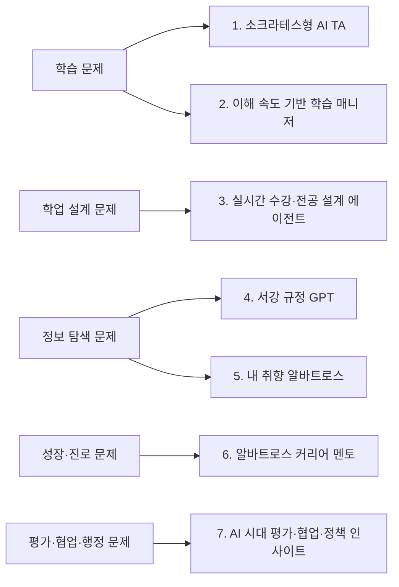
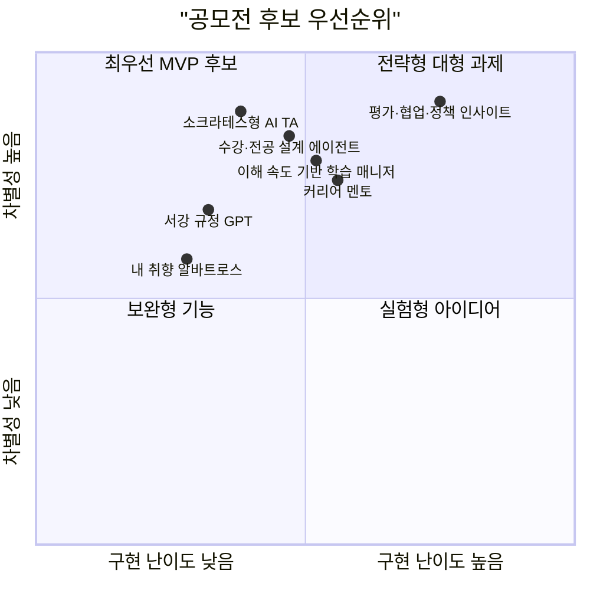
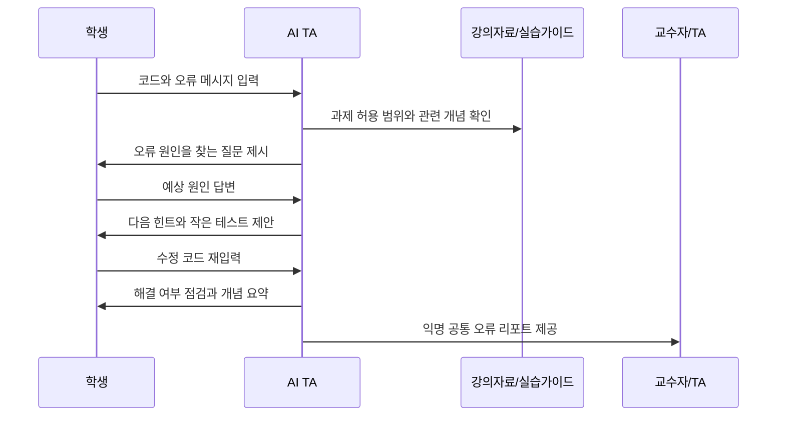
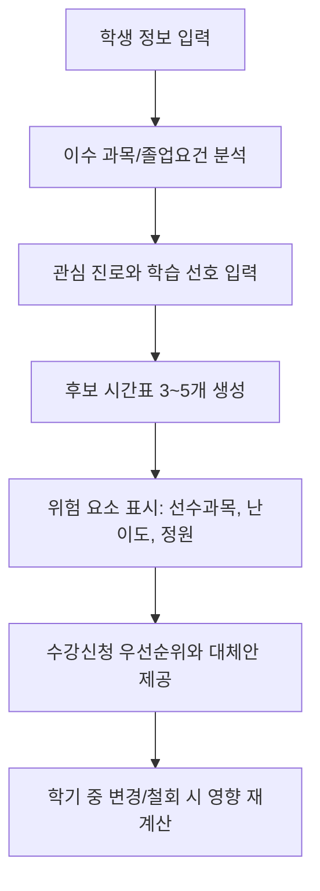
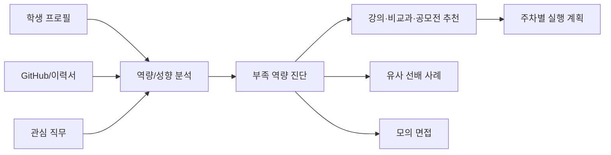
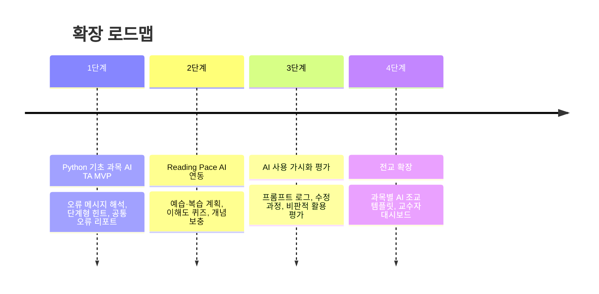

# 서강 AI 서비스 공모전 아이디어 정리

작성일: 2026-05-20  
목적: 팀원들이 낸 아이디어를 유사 문제군끼리 통합하고, 공모전 제출 후보로 검토할 수 있도록 7개 아이디어로 구체화한다.

---

## 0. 전체 방향

이번 아이디어들의 공통 핵심은 "학생과 교직원이 이미 겪고 있는 캠퍼스 문제를 AI로 더 낮은 비용, 더 높은 개인화, 더 빠른 피드백으로 해결한다"는 것이다. 단순 챗봇이나 자동화 툴이 아니라, 서강대학교의 강의, 학칙, 비교과, 동문, 행정 데이터를 연결해 실제 의사결정과 학습 행동을 바꾸는 서비스로 발전시키는 것이 중요하다.

### 통합 기준

| 기준 | 설명 |
|---|---|
| 문제의 명확성 | 학생, 교수, 행정 직원 중 누가 어떤 불편을 겪는지 분명한가 |
| AI 필요성 | 기존 게시판, 검색, 설문, LMS만으로 해결하기 어려운가 |
| 서강 특화 가능성 | 서강의 강의 계획서, 학칙, 동문, 비교과, 수강 데이터와 연결될 수 있는가 |
| 구현 가능성 | MVP를 비교적 작은 범위로 만들 수 있는가 |
| 공익성과 확장성 | 대학 본부와 교수자가 긍정적으로 볼 교육적·행정적 가치가 있는가 |

---

## 1. 아이디어 포트폴리오 맵

---

# 1. 소크라테스형 AI TA

## 한 줄 요약

정답 코드를 대신 작성해주는 것이 아니라, 학생이 오류 원인과 개념을 스스로 발견하도록 질문과 단계별 힌트를 제공하는 학습 보조 에이전트.

## 통합된 원 아이디어

- 프로그래밍 과제 디버깅을 도와주는 소크라테스형 힌트 봇
- AI 리터러시와 자기주도 학습 능력 강화
- Anti-치팅 관점의 AI 사용 가시화 평가와 일부 연결 가능

## 문제 배경

전공 기초 과목이나 융합 교양 과목에서 학생들은 밤늦게 코드 오류, 수식, 실습 환경 문제에 막히는 경우가 많다. 교수자와 TA에게 즉시 질문하기 어렵고, 일반 ChatGPT에 물어보면 전체 정답 코드나 풀이를 바로 받아 학습 과정이 생략된다. 결과적으로 학생은 과제를 제출할 수는 있지만 왜 해결됐는지 이해하지 못한다.

## 핵심 사용자

| 사용자 | 니즈 |
|---|---|
| 학생 | 과제 마감 전에 막힌 지점에 대한 즉각적인 도움 |
| TA | 반복적인 디버깅 질문 감소, 질문 품질 개선 |
| 교수자 | 부정행위 우려를 줄이면서 AI 활용 교육 실현 |

## 주요 기능

1. 강의 계획서·실습 가이드라인 기반 답변
   - 과목별 허용 범위, 사용 라이브러리, 평가 기준을 반영한다.
   - "이 과제에서 직접 제공하면 안 되는 수준의 답"은 제한한다.

2. 단계형 힌트 모드
   - 1단계: 오류 메시지 해석 질문
   - 2단계: 관련 개념 확인
   - 3단계: 의심 코드 위치 안내
   - 4단계: 최소 수정 방향 제시
   - 5단계: 학생이 수정한 뒤 재검토

3. 정답 직접 제공 방지
   - 전체 코드 생성 대신 부분 힌트, 테스트 케이스, 디버깅 질문을 우선 제공한다.
   - 학생이 여러 번 실패하면 "개념 설명 + 작은 예제"까지 허용한다.

4. 학습 로그 리포트
   - 학생이 어떤 오류를 겪었고 어떤 힌트로 해결했는지 요약한다.
   - 교수자에게는 개인 정답이 아닌 익명화된 공통 난점 리포트 제공.

## 사용자 시나리오

## MVP 범위

- Python 기초 과목 1개를 대상으로 시작
- 입력: 코드, 오류 메시지, 과제 설명
- 출력: 단계형 힌트, 개념 확인 질문, 최소 테스트 예시
- 관리자 화면: 많이 발생한 오류 유형 Top 5

## 차별화 포인트

- "AI가 과제를 대신해준다"는 부정적 인식을 "AI가 좋은 질문을 던진다"로 전환한다.
- 대학이 원하는 AI 리터러시, 자기주도 학습, 윤리적 AI 사용을 모두 담을 수 있다.
- 교수자가 과제별 정책을 설정할 수 있어 교육 현장 도입 설득력이 높다.

## 위험 요소와 대응

| 위험 | 대응 |
|---|---|
| 학생이 우회적으로 정답을 요구 | 답변 정책을 과제별로 설정하고 전체 풀이 제공 제한 |
| 힌트가 너무 추상적 | 실패 횟수에 따라 구체성을 점진적으로 높임 |
| 교수자 업무 증가 | LMS 자료 업로드만으로 기본 세팅 가능하게 설계 |

---

# 2. Reading Pace AI: 이해 속도 기반 학습 매니저

## 한 줄 요약

페이지 수가 아니라 학생의 사전지식과 이해 속도를 기준으로 개인별 독서·학습 계획을 재조정하는 적응형 학습 매니저.

## 통합된 원 아이디어

- Reading Pace AI
- 이해도 퀴즈 기반 페이스 조정
- 수식·그래프 이해 지원
- 시험기간 자기관리 코치 기능과 일부 연결 가능

## 문제 배경

많은 학생이 "몇 페이지까지 읽어야 하는지"는 알아도 "무엇을 이해하고 넘어가야 하는지"는 알기 어렵다. 특히 전공 교재, 논문, 수식이 포함된 자료는 같은 10쪽이라도 학생마다 소요 시간이 크게 다르다. 기존 학습 플래너는 일정 관리에는 강하지만 이해도 기반 조정은 부족하다.

## 주요 기능

1. 사전지식 진단
   - 짧은 퀴즈와 자기평가를 통해 학생의 배경지식 수준을 추정한다.

2. 비선형 독서 플랜
   - "47~62쪽을 먼저 읽고, 89쪽 그래프는 미리 훑어보기"처럼 교재 구조에 맞춘 계획을 제공한다.

3. 1분 이해도 체크
   - 중간중간 한 줄 퀴즈, 빈칸 채우기, 개념 연결 질문을 던진다.

4. 페이스 자동 재조정
   - 오답이 많은 개념은 보충 자료를 추천하고, 이미 아는 부분은 빠르게 넘어가게 한다.

5. 회피 행동 코칭
   - 사용자가 설정한 목표와 실제 학습 패턴이 크게 어긋나면 부드러운 코칭 메시지를 제공한다.

## MVP 범위

- PDF 교재 또는 강의노트 업로드
- 챕터 요약, 핵심 개념 추출
- 3일·7일·14일 학습 계획 생성
- 이해도 퀴즈 기반 다음 계획 수정

## 차별화 포인트

- 단순 일정표가 아니라 "이해의 속도"를 추적한다.
- 학생마다 다른 배경지식 차이를 반영하므로 체감 개인화가 크다.
- 소크라테스형 AI TA와 결합하면 예습-실습-복습 루프를 만들 수 있다.

---

# 3. 실시간 수강·전공 설계 에이전트

## 한 줄 요약

졸업요건, 자기설계전공, 시간표, 선수과목, 관심 진로를 동시에 고려해 이번 학기 수강 전략을 설계하는 AI 에이전트.

## 통합된 원 아이디어

- 시간표/자기설계전공/수강신청 실시간 설계 지원
- 수강신청 타로
- 정책 시뮬레이터의 일부 수강 데이터 활용

## 문제 배경

학생들은 졸업요건, 전공 필수, 복수전공, 자기설계전공, 시간표 충돌, 인기 강의 경쟁률을 동시에 고려해야 한다. 정보가 여러 시스템과 PDF, 공지, 선배 조언에 흩어져 있어 매 학기 수강신청이 고난도 퍼즐이 된다.

## 주요 기능

1. 졸업요건 자동 점검
   - 학생의 이수 과목을 기준으로 남은 필수·선택 요건을 계산한다.

2. 시간표 조합 추천
   - 희망 강의, 이동 시간, 공강 선호, 난이도 분산을 반영해 후보 시간표를 생성한다.

3. 자기설계전공 플래너
   - 관심 주제와 커리어 목표를 입력하면 관련 학과 과목을 조합해 전공 설계안을 제안한다.

4. 수강신청 전략
   - 대체 과목, 우선순위, 실패 시 플랜 B를 제공한다.

5. 우연성 추천: 수강신청 타로
   - 요건은 충족하지만 학생이 평소 선택하지 않을 가능성이 높은 강의를 카드 형식으로 추천한다.
   - 필터버블을 깨는 탐색형 추천 기능으로 활용한다.

## 사용자 시나리오

## MVP 범위

- 특정 단과대 또는 전공 1~2개부터 시작
- 공개 강의 정보와 졸업요건 문서 기반
- 수동으로 이수 과목 입력
- 시간표 후보 3개와 졸업요건 체크 리포트 제공

## 차별화 포인트

- 단순 시간표 앱이 아니라 학업 경로 설계 에이전트다.
- 자기설계전공, 복수전공, 진로 목표를 함께 다루면 서강의 융합 교육 이미지와 잘 맞는다.
- 재미 요소인 "수강신청 타로"를 붙여 학생 참여도를 높일 수 있다.

---

# 4. 서강 규정 GPT

## 한 줄 요약

학칙, 내규, 장학, 등록금 환불, 휴복학 등 흩어진 규정을 통합 검색하고 조항·페이지 근거와 함께 답하는 RAG 챗봇.

## 통합된 원 아이디어

- 서강 규정 GPT
- 행정 직원의 케이스 처리 근거 검색
- 학생의 단순 문의 감소

## 문제 배경

학사 규정과 행정 규정은 여러 PDF, 웹페이지, 공지사항에 흩어져 있다. 학생은 어느 문서를 봐야 할지 모르고, 행정 직원은 특정 케이스의 근거 조항을 찾는 데 시간이 걸린다. 잘못된 구두 안내가 발생하면 민원이나 재문의로 이어질 수 있다.

## 주요 기능

1. 규정 통합 인덱싱
   - 학칙, 학사 규정, 장학 규정, 등록금 환불 규정, 휴복학 규정 등을 검색 가능하게 만든다.

2. 근거 인용 답변
   - 답변마다 문서명, 조항, 페이지, 링크를 표시한다.

3. 케이스 기반 질의
   - "2학기 4주차에 휴학하면 등록금 환불이 가능한가요?"처럼 실제 상황을 입력하면 관련 규정을 찾아준다.

4. 학생용·직원용 모드
   - 학생용은 쉬운 설명 중심
   - 직원용은 조항 원문과 처리 절차 중심

5. 불확실성 표시
   - 규정 충돌, 최신 공지 확인 필요, 담당 부서 확인 필요 여부를 명확히 표시한다.

## MVP 범위

- 휴학, 복학, 장학, 등록금 환불 4개 영역
- PDF 업로드 기반 RAG
- 답변에 출처 조항 필수 표시
- "담당 부서 문의 필요" 자동 플래그

## 차별화 포인트

- 대학 행정의 반복 문의를 줄이는 즉시 효과가 있다.
- 학생과 직원이 같은 근거를 보게 되어 안내 품질이 균일해진다.
- 공모전에서 실현 가능성과 공익성이 모두 높게 보일 수 있다.

---

# 5. 내 취향 알바트로스: 교내 행사·기회 큐레이션 피드

## 한 줄 요약

동아리, 세미나, 비교과, 장학, 공모전, 채용 설명회 등 흩어진 캠퍼스 기회를 학생 관심사에 맞춰 개인화 추천하는 AI 피드.

## 통합된 원 아이디어

- 교내 행사 큐레이션 피드
- 학생회·동아리·세미나 공지 정규화
- 학제간 연구자 매칭
- AI 리터러시 진단 후 맞춤 학습 경로 추천

## 문제 배경

학생에게 유용한 행사는 많지만 공지 채널이 흩어져 있다. 학과 홈페이지, 에브리타임, 인스타그램, 카톡방, 비교과 플랫폼, 이메일을 모두 확인하기 어렵다. 결과적으로 관심 있는 학생도 기회를 놓치고, 주최자는 홍보 효율이 낮다.

## 주요 기능

1. 공지 자동 수집·정규화
   - 행사명, 날짜, 장소, 대상, 신청 링크, 마감일을 구조화한다.

2. 관심사 기반 추천
   - 학생의 전공, 관심 키워드, 참여 이력, 진로 목표를 반영한다.

3. 기회 유형별 피드
   - 세미나, 동아리, 공모전, 장학, 연구실, 비교과, 채용 설명회 등으로 분류한다.

4. 연구자·멘토 매칭 확장
   - 학제간 관심 주제를 입력하면 관련 교수, 연구실, 선배, 비교과를 연결한다.

5. 카카오톡/푸시 연동
   - 마감 전 알림, 관심 주제 새 공지 알림을 제공한다.

## MVP 범위

- 학교 공식 공지와 학과 공지 일부 크롤링 또는 수동 업로드
- 관심 키워드 5개 기반 추천
- 주간 개인화 뉴스레터 생성

## 차별화 포인트

- 캠퍼스 정보 과잉 문제를 "개인화된 기회 발견" 문제로 재정의한다.
- 진로 멘토링, 비교과 추천, 연구자 매칭으로 자연스럽게 확장 가능하다.
- 학생 체감도가 높고 데모가 만들기 쉽다.

---

# 6. 알바트로스 커리어 멘토

## 한 줄 요약

학생의 이력서, GitHub, 관심 직무, 성향을 분석해 부족 역량을 진단하고 교내 프로그램, 선배, 모의면접까지 연결하는 진로 코칭 에이전트.

## 통합된 원 아이디어

- 알바트로스 멘토
- 졸업생 연결
- 학제간 연구자 매칭
- 심리·성향 분석
- Future Self 학점 협상가

## 문제 배경

학생은 자신이 어떤 직무에 적합한지, 무엇을 더 준비해야 하는지, 어떤 교내 자원을 활용해야 하는지 알기 어렵다. 특히 비슷한 출발점에서 특정 커리어로 이동한 선배 사례는 강력한 정보지만 접근성이 낮다.

## 주요 기능

1. 역량 진단
   - 이력서, GitHub, 포트폴리오, 수강 과목을 분석해 강점과 공백을 찾는다.

2. 교내 자원 매칭
   - 비교과 프로그램, 강의, 연구실, 세미나, 공모전, 멘토링 프로그램을 추천한다.

3. 졸업생 사례 추천
   - 유사 전공, 관심사, 활동 이력을 가진 선배의 진로 사례를 제시한다.

4. 모의 면접
   - 관심 직무별 질문, 답변 피드백, 음성 면접 연습을 제공한다.

5. Future Self 코칭
   - 학생이 설정한 미래 목표를 바탕으로 학습 회피 순간에 공감형 메시지와 작은 행동 제안을 제공한다.

## 사용자 시나리오

## MVP 범위

- 학생 프로필 수동 입력
- 이력서 PDF 또는 텍스트 분석
- 직무별 역량 체크리스트
- 교내 비교과 프로그램 매칭
- 선배 사례는 가상/익명 예시 데이터로 프로토타입 구성

## 차별화 포인트

- 개인 진로 상담, 교내 자원 추천, 동문 네트워크를 하나의 흐름으로 연결한다.
- 단순 직무 추천보다 "다음 행동"이 명확하다.
- 서강 동문 데이터와 결합되면 학교 특화성이 매우 강하다.

---

# 7. AI 시대 평가·협업·정책 인사이트 플랫폼

## 한 줄 요약

AI 사용이 보편화된 시대에 팀플, 보고서, 강의 이해도, 학사 정책의 문제를 데이터 기반으로 진단하고 개선하는 교수자·행정용 인사이트 플랫폼.

## 통합된 원 아이디어

- 팀플 코파일럿
- Anti-치팅 역설계
- 보고서 claim 검증
- 강의 실시간 공감 분석
- Unasked Questions
- 정책 시뮬레이터
- AI/LLM 사용 여부 감별 서비스

## 문제 배경

대학은 AI 사용을 무조건 금지하기 어렵다. 팀플 무임승차, 보고서 출처 불일치, 학생의 침묵, 정책 변화의 영향 예측 등은 기존 방식으로는 정량화하기 어렵다. 중요한 것은 학생을 감시하는 것이 아니라, 학습 과정과 의사결정 과정을 더 투명하게 만드는 것이다.

## 하위 모듈

### 7-1. 팀플 코파일럿

- 슬랙, 디스코드, 카카오워크 등 협업 기록을 분석한다.
- 회의록 자동 작성, 액션 아이템 분배, 일정 준수율을 요약한다.
- 무임승차 위험 신호를 팀장 또는 교수자에게 조심스럽게 알린다.

### 7-2. AI 사용 가시화 평가

- "AI를 썼는가"보다 "어떻게 썼는가"를 평가한다.
- 학생이 AI 사용 로그, 프롬프트, 수정 과정, 검증 과정을 제출하도록 돕는다.
- LLM이 단순 복붙, 비판적 수정, 사실 검증 여부를 루브릭 기준으로 평가 보조한다.

### 7-3. 학술 글쓰기 claim 검증

- 보고서를 claim 단위로 분해한다.
- Google Scholar, 학내 DB, 제출 참고문헌과 대조한다.
- 인용 누락, 출처 불일치, 과도한 주장, 근거 부족을 표시한다.

### 7-4. 묻지 못한 질문 큐레이터

- 학생들이 익명으로 제출한 "물어볼까 말까 한 질문"을 클러스터링한다.
- 교수자에게 이번 주 가장 많이 망설여진 질문 3개와 보충 설명 포인트를 제공한다.

### 7-5. 정책 시뮬레이터

- 수강 정원, 장학 기준, 교양 필수 변경 같은 정책 변화의 영향을 과거 데이터와 학생 페르소나로 예측한다.
- 저학년, 복수전공, 외국인, 편입생 등 학생군별 영향 차이를 시각화한다.

## MVP 범위

이 아이디어는 범위가 크므로 공모전에서는 하나의 플랫폼으로 말하되, MVP는 다음 중 하나로 좁히는 것이 좋다.

| MVP 후보 | 장점 | 난점 |
|---|---|---|
| 묻지 못한 질문 큐레이터 | 교육적 가치가 크고 프라이버시 부담이 낮음 | 학생 참여 유도 필요 |
| AI 사용 가시화 평가 | 시대성·차별성이 매우 큼 | 평가 공정성 설계 필요 |
| 팀플 코파일럿 | 학생 체감 문제 강함 | 감시 논란 관리 필요 |
| claim 검증 | 학술 글쓰기와 연결성 높음 | 외부 DB 연동 필요 |

## 차별화 포인트

- AI 시대의 대학 평가와 협업 문화를 재설계한다는 큰 서사가 있다.
- "감시"가 아니라 "투명한 과정 평가와 학습 개선"으로 포지셔닝해야 한다.
- 여러 아이디어를 하나로 묶을 수 있지만, 제출안은 MVP를 명확히 좁혀야 설득력이 생긴다.

---

# 최종 후보 추천

## 1순위: 소크라테스형 AI TA

가장 공모 분야와 잘 맞고, 학습 지원·AI 활용 교육이라는 주제에 직접 대응한다. 공익성, 교육적 가치, 구현 가능성의 균형이 좋다. "정답 제공 AI"에 대한 우려를 "좋은 질문을 던지는 AI"로 전환하는 메시지가 강하다.

## 2순위: 실시간 수강·전공 설계 에이전트

학생 체감도가 매우 높고, 서강의 자기설계전공·융합 교육과 연결하기 좋다. 다만 실제 데이터 연동이 어려울 수 있으므로 MVP는 제한된 전공과 수동 입력으로 시작하는 것이 좋다.

## 3순위: 서강 규정 GPT

구현 가능성이 높고 행정 효율 개선 효과가 분명하다. 다만 이미 존재할 법한 RAG 챗봇으로 보일 수 있으므로, 학생용·직원용 이중 모드와 근거 인용 품질을 강조해야 한다.

## 4순위: AI 사용 가시화 평가 또는 묻지 못한 질문 큐레이터

차별성과 시대성이 가장 강하다. 다만 민감한 평가·프라이버시 이슈가 있으므로 단독 제출 시 윤리 설계와 데이터 보호 방안을 매우 구체적으로 제시해야 한다.

---

# 공모전 제출용 압축안 예시

## 추천 제출명

"Sogang Socratic AI TA: 정답이 아니라 질문을 주는 AI 조교"

## 제출용 한 줄 요약

강의자료와 과제 가이드라인을 기반으로 학생에게 정답 대신 단계별 힌트와 유도 질문을 제공해, AI 시대의 자기주도 학습과 윤리적 AI 활용을 돕는 학습 지원 에이전트.

## 핵심 슬로건

"AI가 대신 풀어주는 과제가 아니라, AI와 함께 이해해가는 학습."

## 확장 로드맵

---

# 향후 팀 논의 체크리스트

- 어떤 공모 분야에 최종 제출할 것인가?
- 7개 중 하나를 단독 제출할 것인가, 혹은 하나를 메인으로 두고 확장 로드맵에 다른 아이디어를 넣을 것인가?
- 실제 데모는 어떤 데이터로 만들 것인가?
- 서강 특화 요소를 어떤 자료나 시스템과 연결해 보여줄 것인가?
- 프라이버시, 평가 공정성, AI 오남용 방지 정책을 어떻게 설명할 것인가?
- 발표에서 30초 안에 심사위원을 설득할 Hook은 무엇인가?

